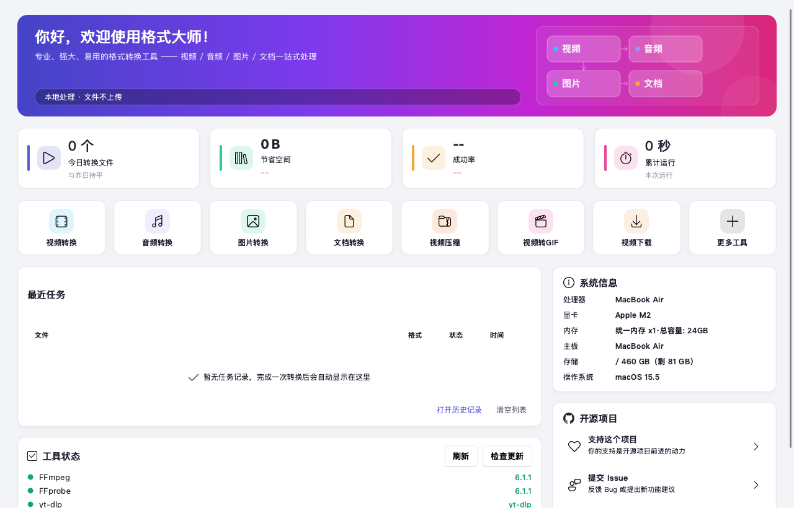

<div align="center">

# 🔄 FormatMaster / 格式大师

**All-in-one format converter for video, audio, image & documents.**
  
**全能格式转换工具 — 视频、音频、图片、文档一站式转换**


---

### License

FormatMaster public releases are licensed under
[AGPL-3.0-or-later](LICENSE). Historical MIT attribution is preserved in
[NOTICE](NOTICE). Third-party components remain subject to their own terms in
[THIRD_PARTY_NOTICES.md](THIRD_PARTY_NOTICES.md).



---

[中文](#中文) · [English](#english) · [隐私 / Privacy](PRIVACY.md) · [安全 / Security](SECURITY.md)

</div>

---

## 中文

### ✨ 功能总览

> **导航：10 组 35 入口** · **内置插件：32 个** · **设置：11 分区**

| 模块          | 说明                                                        |
| ----------- | --------------------------------------------------------- |
| 🎬 视频转换     | MP4、AVI、MKV、WMV、MOV、FLV、WEBM、TS、MPEG、3GP                  |
| 🎵 音频转换     | MP3、WAV、WMA、AAC、FLAC、OGG、M4A、AMR、OPUS                     |
| 🖼 图片转换     | JPG、PNG、BMP、GIF、TIFF、WEBP、ICO、TGA                         |
| 📄 文档转换     | PDF ↔ Word ↔ Excel ↔ PPT ↔ WPS ↔ TXT ↔ HTML ↔ 图片（168+种组合） |
| ✂ 视频处理      | 剪辑片段、多文件合并、字幕烧录、变速（0.5x-2.0x）                             |
| 📦 视频压缩     | 高/中/低质量预设，支持分辨率限制                                         |
| 🎬 视频抽帧+缩略图 | 单张序列 / N×M 缩略图墙 双模式                                       |
| ⊙ 视频转GIF    | 自定义宽度、帧率、时间区间 + 双滑块选段                                     |
| ⊞ PDF合并/拆分  | 多个PDF合并为一个，按页码范围拆分                                        |
| 🔒 PDF加密/解密 | AES-256/AES-128加密，会话内密码复用（退出即清除）                         |
| 🗜 PDF压缩    | 降低PDF体积，支持DPI和图片质量控制                                      |
| 📖 PDF预览    | 应用内 QPdfView 预览：翻页、页码跳转、缩放                                |
| 🖼 证件照      | 换底色、尺寸预设、**A6 相纸排版（1寸16张/2寸9张）+ 直接打印**                    |
| ⊡ 图片压缩      | 质量控制、分段切换（按质量 / 按目标大小）                                    |
| ✏ 批量重命名     | 模板支持 `{n}` 序号、`{name}` 原名、`{date}` 日期占位符                  |
| 🏷 图片水印     | 文字/图片水印，5种位置选择                                            |
| 🔊 音频增强     | 音量、响度归一化、效果处理                                             |
| 🎵 音频波形     | 应用内波形预览（FFmpeg 解码 + pyqtgraph）                            |
| 🔍 格式检测     | 批量扫描文件夹，按格式自动分类，支持文件头魔数检测                                 |
| 📊 媒体信息     | 容器 / 编码器 / 分辨率 / 码率 / 音视频流详情                              |
| 📥 视频下载     | 支持 B站/YouTube/微博/Instagram 等数百个平台（基于yt-dlp）               |
| 📦 M3U8下载   | 链接解析、画质解析、批量队列（独立面板）                                      |
| 🖼 视频预览     | 应用内播放器（播放/暂停/进度/倍速）                                       |
| ☐ 表格识别      | 图片表格 OCR → CSV / Excel（RapidTable 结构还原）                   |
| 📁 文件夹监视    | 监视目录自动转换新文件（视频→MP4 / 音频→MP3 / 图片→PNG）                     |
| 🎬 视频反挤压    | 修复画面被压扁拉长（自动修 SAR / 手动目标比例）                               |
| 🧩 插件中心     | 32 个内置插件（哈希/进制/JSON/URL/编码/简繁转换等）+ 安装/编辑源码                |
| 💻 代码编辑器    | 语法高亮查看/编辑（Python/JSON/JS）——插件右键「编辑源码」                     |
| 📊 数据大屏     | ECharts 交互图表（近30天趋势、类型分布）——历史页                            |
| 🌫 毛玻璃质感    | Win11 Mica 云母窗口 + 毛玻璃工具条                                  |
| 💾 任务队列持久化  | 退出自动恢复中断任务、一键重试、并行 1–8                                    |
| 🔁 失败自动恢复   | 转换失败自动修复源文件/降级重试（全程落日志）                                   |
| 🌐 中英双语     | 简体中文 / English 界面语言切换                                     |

---

### 🎬 视频转换 — 详细说明

**支持格式**：MP4、AVI、MKV、WMV、MOV、FLV、WEBM、TS、MPEG、3GP

| 设置项      | 选项                                                    |
| -------- | ----------------------------------------------------- |
| 目标格式     | MP4、AVI、MKV、WMV、MOV、FLV、WEBM、TS、MPEG、3GP              |
| 视频编码     | 默认、H.264、H.265/HEVC、VP9、MPEG4                         |
| 画质预设     | 原始质量、高质量(大文件)、中等质量、低质量(小文件)、手机、网络分享                   |
| 分辨率      | 原始、4K (3840×2160)、2K (2560×1440)、1080p、720p、480p、360p |
| 帧率       | 原始帧率、24、25、30、60 fps                                  |
| 码率       | 自动、1M、2M、5M、8M、10M、20M                                |
| 仅转封装(无损) | 开/关 — 仅重封装不重编码（仅限 MP4/MKV/TS/FLV/MOV）                 |
| 快速预设     | 自定义 + 用户预设模板                                          |
| 输出目录     | 与源文件同目录 / 自定义目录                                       |

**特殊能力**：

- **流选择**：可选择性保留/移除音视频流
- **编码兼容性校验**：自动检测无损模式下的编码兼容性（如 H.265→FLV）
- **自动重命名**：输出文件与输入同名时自动加 `_1` 后缀

---

### 🎵 音频转换 — 详细说明

**支持格式**：MP3、WAV、WMA、AAC、FLAC、OGG、M4A、AMR、OPUS

| 设置项  | 选项                                    |
| ---- | ------------------------------------- |
| 目标格式 | MP3、WAV、WMA、AAC、FLAC、OGG、M4A、AMR、OPUS |
| 比特率  | 128k、192k、256k、320k                   |
| 采样率  | 原始、22050、44100、48000、96000            |
| 声道   | 原始、单声道、立体声                            |
| 音量调节 | 20% ~ 200%（滑块控制）                      |
| 输出目录 | 与源文件同目录 / 自定义目录                       |

---

### 🖼 图片转换 — 详细说明

**支持格式**：JPG、PNG、BMP、GIF、TIFF、WEBP、ICO、TGA

| 设置项  | 选项                                    |
| ---- | ------------------------------------- |
| 目标格式 | JPG、PNG、BMP、GIF、TIFF、WEBP、ICO、TGA     |
| 质量   | 100(无损)、95(高质量)、85(中等)、70(低质量)、50(压缩) |
| 缩放   | 原始大小、50%、25%、200%                     |
| 旋转   | 0°、90°、180°、270°                      |
| 裁剪   | 原始比例、裁剪为正方形                           |
| 灰度   | 开/关 — 转为黑白                            |
| 水印文字 | 自定义输入                                 |
| 水印位置 | 右下角、左下角、右上角、左上角、居中                    |
| 输出目录 | 与源文件同目录 / 自定义目录                       |

---

### 📄 文档转换 — 详细说明

**支持格式**：PDF、DOCX、DOC、WPS、XLSX、XLS、ET、CSV、PPTX、PPT、DPS、TXT、HTML、HTM、MD、EPUB、RTF、ODT、JPG、JPEG、PNG、BMP、TIFF、WEBP

**168+ 种转换组合**：

| 源格式  | 可转目标                                 |
| ---- | ------------------------------------ |
| PDF  | DOCX、DOC、TXT、JPG、PNG、HTML、PPTX、XLSX  |
| DOCX | PDF、TXT、HTML、JPG、PNG、PPTX、MD、DOC、WPS |
| DOC  | PDF、TXT、DOCX、HTML、MD                 |
| WPS  | DOCX、PDF、TXT、HTML、MD                 |
| XLSX | PDF、CSV、TXT、JPG、PNG、HTML、MD、ET       |
| XLS  | XLSX、PDF、CSV、TXT、JPG、PNG、HTML、MD     |
| CSV  | XLSX、PDF、TXT、HTML、MD                 |
| PPTX | PDF、TXT、JPG、PNG、PPT、DPS、DOCX、HTML、MD |
| PPT  | PPTX、PDF、TXT                         |
| TXT  | PDF、XLSX、DOCX、PPTX、HTML、MD           |
| HTML | PDF、DOCX、TXT、XLSX、MD                 |
| MD   | HTML、PDF、DOCX、TXT                    |
| EPUB | PDF、TXT、HTML、DOCX                    |
| RTF  | TXT、PDF、DOCX                         |
| ODT  | PDF、DOCX、TXT                         |
| 图片   | PDF、DOCX                             |

**特殊能力**：

- **格式检测**：自动识别源文件格式并列出可转换目标
- **Word转PDF**：通过 Microsoft Word COM 自动化
- **PPT转PDF**：通过 Microsoft PowerPoint COM 自动化
- **格式兼容性实时提示**：显示当前源/目标格式是否兼容

---

### ⊙ 视频转GIF — 详细说明

| 设置项     | 选项                 |
| ------- | ------------------ |
| 宽度      | 原始、640、480、320、240 |
| 帧率      | 10、15、20、24、30 fps |
| 开始时间(秒) | 0                  |
| 时长(秒)   | 5、10、15、30、60、全部   |
| 输出目录    | 与源文件同目录 / 自定义目录    |

---

### 🔒 PDF工具 — 详细说明

**5种操作模式**：

| 模式        | 功能      | 参数                                   |
| --------- | ------- | ------------------------------------ |
| 合并（多个→一个） | 多PDF合并  | —                                    |
| 拆分（一个→多个） | 按页码范围拆分 | 页码范围：`1-3,5,7-10`                    |
| 加密（设置密码）  | PDF加密   | 打开密码、权限密码、加密方式(AES-256/AES-128)      |
| 解密（移除密码）  | PDF解密   | 输入密码                                 |
| 压缩        | 降低PDF体积 | 目标分辨率(72/100/150/200dpi)、图片质量(60-90) |

**附加功能**：

- **会话密码复用**：当前运行期间保留最近10条，退出即清除且不写入磁盘
- **密码显示/隐藏切换**：点击眼睛图标切换

---

### 📥 视频下载 — 详细说明

**支持平台**：B站、YouTube、微博、Instagram 等数百个平台（基于 yt-dlp）

| 功能          | 说明                      |
| ----------- | ----------------------- |
| URL解析       | 自动提取有效URL，过滤中文等非ASCII字符 |
| 格式获取        | 列出所有可用格式（分辨率、大小、格式ID）   |
| 格式选择        | 从列表中选择目标格式              |
| 保存目录        | 默认 ~/Downloads，可自定义     |
| 抖音/TikTok提示 | 检测到抖音链接时显示平台限制警告        |
| yt-dlp版本检测  | 侧边栏显示版本，有新版本时提示更新       |

---

### 🔍 格式检测 — 详细说明

| 功能        | 说明                                                                    |
| --------- | --------------------------------------------------------------------- |
| 文件夹扫描     | 递归遍历所有文件                                                              |
| 扩展名分类     | 按视频/音频/图片/文档/PDF/其他自动分类                                               |
| 文件头魔数检测   | 通过二进制头识别真实格式（PDF、JPEG、PNG、GIF、BMP、RIFF、MKV、MP4、ID3、FLAC、OGG、OLE、ZIP等） |
| 格式不匹配警告   | 扩展名与内容不符时标红提示                                                         |
| 选择性批量转换   | 勾选文件后一键批量转换                                                           |
| 全选/取消全选   | 批量操作控制                                                                |
| 重新检测      | 重置并重新扫描                                                               |
| 自动添加到对应面板 | 检测结果自动分发到各功能面板                                                        |

---

### 🖼 预设裁剪 — 详细说明

| 设置项  | 选项                        |
| ---- | ------------------------- |
| 预设尺寸 | 社交媒体标准尺寸（1:1 1080×1080 等） |
| 裁剪模式 | cover（裁剪填充）/ fit（等比适应）    |
| 输出目录 | 与源文件同目录 / 自定义目录           |

---

### 📊 任务系统

| 功能   | 说明                                      |
| ---- | --------------------------------------- |
| 任务队列 | 信号驱动调度，可配置并行 1–8                     |
| 任务状态 | waiting → processing → success / failed |
| 进度显示 | Treeview表格 + 进度条 + 状态文本                 |
| 任务清空 | 清空所有已完成任务                               |
| 取消转换 | 立即终止当前任务                                |

---

### 📝 日志系统

| 功能   | 说明                                     |
| ---- | -------------------------------------- |
| 实时日志 | 底部Notebook面板，最多保留50行                   |
| 日志级别 | success(绿)、error(红)、warning(黄)、info(蓝) |
| 日志清空 | 清空所有日志                                 |
| 双击复制 | 双击单行日志复制到剪贴板                           |

---

### ⚙️ 用户偏好

| 功能     | 说明                                            |
| ------ | --------------------------------------------- |
| 面板参数保存 | 切换面板时自动保存所有设置                                 |
| 面板参数恢复 | 切换回来时恢复上次设置                                   |
| 持久化存储  | Windows/macOS: `FormatMaster/data`（macOS 位于 `~/Library/Application Support/FormatMaster/data`） |

---

### 🔄 更新检查

| 功能     | 说明                    |
| ------ | --------------------- |
| 启动自动检查 | 后台线程检查GitHub releases |
| 手动检查   | 关于窗口中可手动触发            |
| 更新通知   | Windows 可校验下载并自动回滚更新；macOS 跳转签名安装包 |
| 版本比较   | 支持语义化版本               |

---

### 🚀 快速开始

#### 直接下载（推荐）

前往 [最新 Release](https://github.com/zhangsijie03/formatmaster-desktop/releases/latest)，
按 Mac 芯片选择对应的 DMG：

| 设备 | 下载文件 | 说明 |
| --- | --- | --- |
| Apple Silicon（M1/M2/M3/M4） | `FormatMaster-*-macOS-arm64.dmg` | 原生 ARM64 |
| Intel Mac | `FormatMaster-*-macOS-x86_64.dmg` | 原生 Intel |
| Windows 10/11 x64 | `FormatMaster-*-windows-x64-portable.zip` | 解压后直接运行 |

每个正式 Release 同时提供 `SHA256SUMS.txt` 和 SPDX SBOM。打开 macOS DMG 后，
将“格式大师”拖入“应用程序”。正式发布包必须通过 Developer ID 签名和 Apple
公证；若系统仍提示来源异常，请停止运行并在仓库提交问题，不要绕过 Gatekeeper。

#### 下载使用（Windows）

从 [最新 Release](https://github.com/zhangsijie03/formatmaster-desktop/releases/latest) 下载 Windows ZIP，解压后进入 `格式大师` 文件夹，双击其中的 `格式大师.exe` 即可使用。

#### 从源码运行（Windows）

```bash
# 克隆仓库
git clone https://github.com/zhangsijie03/formatmaster-desktop.git
cd formatmaster-desktop

# 安装依赖
pip install -r requirements.txt

# 运行应用
python main_qt.py

# 打包为exe
python build.py
```

#### macOS 从源码运行

macOS 使用系统 FFmpeg。Apple Silicon 和 Intel Mac 都需要在对应架构的
Python 环境中安装依赖并构建，当前不提供自动下载 FFmpeg。

```bash
brew install ffmpeg
python3 -m venv venv
source venv/bin/activate
python -m pip install -r requirements.txt -r requirements-dev.txt
python main_qt.py
python build.py
```

打包后的 `.app` 会注册常见视频、音频、图片和文档格式，用户可在 Finder
「打开方式」中选择格式大师。

macOS 发布构建（需要 Apple Developer ID；默认构建不会签名）：

```bash
# 仅生成 DMG
python build.py --dmg

# 签名并生成 DMG
python build.py --dmg --sign-identity "Developer ID Application: Your Name (TEAMID)"

# 使用已保存的 notarytool Keychain profile 公证并装订票据
python build.py --dmg \
  --sign-identity "Developer ID Application: Your Name (TEAMID)" \
  --notarize-profile FormatMasterNotary
```

`--sign-identity` 和 `--notarize-profile` 也可分别通过
`MACOS_SIGN_IDENTITY`、`MACOS_NOTARY_PROFILE` 环境变量传入。本地开发可使用
ad-hoc 构建，但 GitHub 正式发布门禁强制 Developer ID 签名和公证。macOS 程序
更新通过 Releases 手动安装，Windows 免安装版支持带 SHA-256 校验和回滚的更新。

### 🛠 技术栈

- **界面**: Python PySide6 + qfluentwidgets（Fluent Widgets，Prism 设计系统）
- **视频/音频**: FFmpeg（源码运行使用系统 PATH；官方 Windows/macOS 发布包内置静态 FFmpeg/FFprobe）
- **图片**: Pillow
- **文档**: python-docx、openpyxl、python-pptx、pypdf、pdf2docx、reportlab、PyMuPDF
- **Word转PDF**: Windows 使用 Office COM；其他平台使用 LibreOffice/纯 Python 降级
- **PPT转PDF**: Windows 使用 Office COM；其他平台使用 LibreOffice/纯 Python 降级
- **视频下载**: yt-dlp
- **OCR**: RapidOCR + RapidTable（onnx）
- **高级控件**: QtPdf / QtWebEngine / QtMultimedia / QtDataVisualization（PySide6 内置）、pyqtgraph、superqt
- **图表**: ECharts（本地离线资源）
- **文字转换**: opencc（简繁词汇级转换）
- **打包**: PyInstaller

### 📁 项目结构

```
FormatMaster/
├── main_qt.py           # 主程序入口（PySide6 界面）
├── build.py             # PyInstaller打包脚本
├── requirements.txt     # Python依赖
├── assets/
│   ├── icon.ico         # Windows 应用图标
│   ├── icon.icns        # macOS 应用图标
│   ├── icon.ico         # Windows 应用图标
│   └── echarts/         # ECharts 本地离线资源（数据大屏）
├── gui_qt/              # PySide6 + Fluent Widgets 界面
│   ├── app.py           # MainWindow（FluentWindow + Mica）
│   ├── nav_registry.py  # 导航注册真源
│   ├── services.py      # QtServices 服务容器
│   ├── task_manager.py  # 任务队列（信号驱动，并行 1-8）
│   ├── pages/           # 首页/任务/历史/设置/关于
│   ├── panels/          # 功能面板（视频、音频、PDF、OCR 等）
│   └── components/      # 侧边栏、主题管理、设计系统、通用控件
├── plugins/             # 32 个内置插件（声明式 PLUGIN_INFO）
├── core/                # 业务逻辑（无 UI 依赖）
│   ├── video_converter.py   # 视频转换（FFmpeg）
│   ├── audio_converter.py   # 音频转换（FFmpeg）
│   ├── image_converter.py   # 图片转换（Pillow）
│   ├── doc_converter.py     # 文档转换（168+种组合）
│   ├── video_downloader.py  # 视频下载（yt-dlp）
│   ├── pdf_editor.py        # PDF编辑
│   ├── ocr_tool.py          # OCR识别（RapidOCR）
│   ├── auto_recover.py      # 失败自动恢复（修复/降级重试）
│   └── tools.py             # PDF合并/拆分/加密/压缩、图片压缩、批量重命名
├── utils/
│   ├── config.py            # 配置与格式定义
│   ├── ffmpeg_manager.py    # FFmpeg下载管理
│   ├── hardware_accel.py    # NVENC / QSV / AMF / VideoToolbox 硬件加速检测
│   └── format_helpers.py    # 格式辅助工具
└── app/
    ├── logger.py            # 线程安全轮转日志
    ├── exceptions.py        # EX_HINT 异常中文映射
    └── crash_report.py      # 全局异常钩子
```

### 🖥 技术特性

| 特性       | 实现方式                             |
| -------- | -------------------------------- |
| DPI高分屏适配 | `SetProcessDpiAwareness(2)`      |
| 双缓冲渲染    | DWM API，消除界面闪烁                   |
| 黑边修复     | 窗口映射事件触发强制重绘                     |
| 异常中文映射   | 20+种异常→中文用户提示                    |
| 窗口自适应    | 80%屏幕，最小880×620                  |
| 线程安全     | 所有耗时操作在子线程，UI更新通过 `root.after()` |
| 拖拽支持     | ctypes（优先）+ windnd（降级）双重支持       |

---

### 📝 更新日志

#### v1.4.12 (2026-08-27)

- 局域网面板改为直接枚举网卡地址，避免异常 DNS 导致界面启动卡顿
- 增加不依赖主机名解析的 LAN 地址回归测试

#### v1.4.11 (2026-08-27)

- 修正 Windows 子进程无窗口标志与 macOS LibreOffice 分支的跨平台测试契约
- 完成 Ubuntu、Windows、macOS 三平台发布回归

#### v1.4.10 (2026-08-27)

- 修复 Linux 无系统中文字体时 Office→PDF 降级渲染的中文文本层
- 修复 Windows 平台模拟与 subprocess 无窗口参数的运行时判定
- 修复 Windows 非 UTF-8 区域设置下身份证日期解析异常
- 统一任务运行态契约为 `processing`，完成三平台发布门禁修复

#### v1.4.9 (2026-08-26)

- ✨ 重构首页与转换面板布局、空状态、操作栏及响应式细节，改善宽屏与紧凑窗口体验。
- 🎨 统一页面标题、表单分组、控件高度、间距及主次操作层级。
- 🧰 修复源码环境未激活 PATH 时无法发现 yt-dlp 的问题。
- 🎞️ 文字水印改用透明图层合成，不再依赖 FFmpeg 的可选 `drawtext` 滤镜。
- ✅ 在干净 Python 3.11 环境完成 472 项全量回归，并重新验证 macOS DMG 和打包后真实转换。

#### v1.4.8 (2026-08-26)

- 📡 恢复本地 REST API，提供健康检查、视频转换和文档转换接口。
- 🧭 任务中心改为 500ms FIFO 调度，并补齐清除、取消、日志清空与双击复制。
- 🎞️ 修复分辨率预设的宽高比保持逻辑，避免非标准比例素材被拉伸。
- 🍎 完成 macOS 原生字体、Qt 样式、应用图标、arm64 `.app` 与 DMG 交付验收。
- ✅ 新增验收契约回归测试，全量测试、真实媒体转换和打包 API 均验证通过。

#### v1.4.7 (2026-08-25)

- 🪟 修复 Windows Runner 使用 cp1252 输出中文路径/警告时导致构建提前失败的问题。
- ✅ 构建脚本统一使用 UTF-8 控制台输出，并保留不可编码字符替换策略，确保 CI 日志和本地构建稳定。

#### v1.4.6 (2026-08-25)

- macOS 发布改用推荐的 onedir `.app` 布局，避免 PyInstaller onefile 兼容性警告。
- 修复 Finder 文件关联写入后未恢复临时签名的问题；未配置 Developer ID 时使用有效 ad-hoc 签名。
- 将发布版本写入 macOS Bundle 元数据，便于 Finder 和崩溃报告识别版本。
- Windows 改用 onedir 目录 ZIP，降低 QtWebEngine、OCR 和 PyMuPDF 组合打包失败风险。
- 增加 Windows 构建预检和失败诊断 artifact，便于维护者快速定位 runner 环境问题。

#### v1.4.5 (2026-08-25)

#### v1.4.4 (2026-08-25)

#### v1.4.3 (2026-08-25)

- 🐛 修复 GitHub Actions macOS 发布包中 FFmpeg/FFprobe 路径读取错误
- 🐛 修复 PyMuPDF 新包名导致 Windows PyInstaller 预检失败的问题
- ✅ 重新验证 macOS DMG、Windows ZIP 和 Release 自动发布链路

#### v1.4.2 (2026-08-25)

- 📦 新增 GitHub Actions 多平台发布：Apple Silicon / Intel macOS DMG、Windows x64 免安装 ZIP
- 🧰 发布包内置静态 FFmpeg、FFprobe 和 yt-dlp，下载后无需额外安装 Homebrew
- 💿 DMG 使用标准 Applications 拖拽安装布局，并提供 SHA256 校验文件
- 🔐 发布流程支持 Developer ID 签名、Apple notarization 和票据装订
- 🧪 发布前自动执行构建、DMG 完整性校验和跨平台 CI

#### v1.4.1 (2026-08-21)

- 🛠 工具更新文件改存软件 bin 目录（不再与 C 盘双份占用），历史副本自动清理
- 📌 侧边栏展开/折叠状态与上次停留页面记忆，重启自动恢复
- 💾 偏好落盘全面加固：退出统一收尾 + fsync 物理落盘，断电/强杀进程不丢配置
- 🔐 补全 PDF 密码历史（最近 10 条一键复用）
- 🧹 应用自更新与 FFmpeg 下载中断残留自动清理
- ⚡ 修复页面切换动画信号重复连接泄漏、面板参数自动保存失效（Fluent 控件）
- 🪟 新增「毛玻璃效果」开关（设置 → 外观），性能敏感场景可关闭 Win11 Mica
- 🛡 坏配置容错：配置损坏不再导致启动崩溃

#### v1.4.0 (2026-08-19)

- 📖 新增应用内预览三件套：PDF 预览（QtPdf）、HTML 预览（QtWebEngine）、视频预览（QtMultimedia）
- 🎵 新增音频波形预览（pyqtgraph）与 GIF 双滑块选段（superqt，与游标双向同步）
- 🖼 证件照升级：A6 相纸排版（1寸16张/2寸9张）
- 📊 历史页新增 ECharts 数据大屏（30 天趋势 + 类型分布）
- 💻 插件中心新增「编辑源码」（语法高亮）；全量补全插件能力
- 🧭 侧边栏导航精简 41→35：删除冗余入口，抽帧与缩略图墙合并双模式
- 🎛 图片压缩分段切换、设置页面包屑、历史清空二次确认、M3U8 添加链接自动解析画质
- ⚡ 明暗主题切换提速 2.6s→60ms、全局滚轮流畅度优化、FFmpeg/yt-dlp 更新体验增强
- 🐛 修复 SpinBox 微调箭头灰块、转换失败误报、任务状态卡重复刷新等
- 🛡 QA 加固：配置损坏容错、ffprobe 时长清洗、Image.open 句柄管理、失败自动恢复落日志

#### v1.3.6 (2026-08-08)

- 🎭 新增幻影坦克：一张图片白底显示一张、黑底显示另一张（制作 / 解密，numpy 透明通道编码）
- 🎬 新增视频反挤压：修复画面被压扁拉长（自动按 DAR 修 SAR 流复制 / 手动目标比例重编码）
- 📊 新增媒体信息：容器 / 编码器 / 分辨率 / 帧率 / 码率 / 音视频流详情（MediaInfo 风格）
- ⚡ 新增场景化转换：8 个使用场景（抖音 / 微信 / 邮件 / 公众号 / B站 / 网课 / 存档 / 极速）一键自动匹配参数
- 📋 剪贴板监视增强：独立目标类型与格式选择 + 截图动作（仅保存 / OCR 识别 / 保存并 OCR）
- 🐛 修复转换失败通知误报：跨面板不再误弹通知、批量完成只统计本次失败（历史失败任务不再误报）
- 🐛 修复剪贴板监视输出目录浏览不显示、无音轨视频变速失败等问题

#### v1.3.5 (2026-08-06)

- 🌐 全站中英双语：导航/面板/按钮/下拉选项/任务提示 400+ 文案双语化
- 💾 任务队列持久化：应用退出后自动恢复中断任务，任务中心可一键重试
- 🔁 失败任务一键重试：任务中心新增重试按钮（失败/取消任务直接重新入队）
- 🖼 新增视频抽帧：按固定间隔批量截取关键帧（封面、预览、场景截图）
- 🚫 新增视频去水印：FFmpeg delogo 滤镜，区域自动钳制防止越界
- ⚡ 并发任务数按 CPU 核数自适应推荐（≥8 核推荐 4）
- 📦 打包瘦身：排除 onnxruntime 可选子模块（transformers/quantization/tools）

#### v1.3.1 (2026-08-03)

- 🏗  架构重构：16 个功能面板 DI 化迁移至独立模块，main.py 瘦身
- 🔧 接入 app.exceptions/app.theme/utils.format_helpers 公共模块，消除内联重复
- 🐛 修复批量重命名大小写转换误改扩展名问题（`photo.jpg` → `PHOTO.JPG` → `PHOTO.jpg`）
- 🧪 新增 pytest 单元测试套件（72 测试覆盖纯函数与 \_fmt_n 回归）
- ⚡ 新增硬件加速支持（NVIDIA NVENC / Intel QSV / AMD AMF / Apple VideoToolbox）
- 🔧 FFmpeg 下载失败增强 UX（重试 + 错误详情 + 手动选择 + 下载页）
- 📦 PyInstaller 打包配置增强（onedir + collect-all pymupdf/PIL/rapidocr）

#### v1.3.0 (2026-07-23)

- 📥 新增视频下载功能（基于yt-dlp，支持数百个平台）
- 🎬 新增视频快速预设（一键应用常用配置组合）
- 🔒 新增PDF密码历史记录（保存最近10条密码，支持一键复用）
- 🔍 格式检测新增文件头魔数识别（通过二进制头判断真实格式，不受扩展名误导）
- 📄 文档格式兼容性实时提示（自动判断源/目标格式是否可转换）
- 🖼  文件属性预览（选中文件后异步显示时长、分辨率、编码信息）
- 🔒 新增PDF加密/解密功能（AES-256/AES-128）
- 🗜  新增PDF压缩功能（DPI + 质量控制）
- 🔄 启动自动更新检查（后台检测GitHub最新版本，发现新版本顶部横幅通知）
- 🖼  新增图像预设裁剪功能（社交媒体尺寸）
- 🐛 修复输出文件与输入同名时自动重命名（加 `_1` 后缀避免覆盖）

#### v1.1.0 (2026-07-16)

- 🔊 新增音频音量调节功能（20%-200%）
- 🏷  新增图片水印添加功能（支持5种位置）
- 📊 新增底部状态流面板（实时进度日志、自动滚动、错误标红）
- 🔍 新增格式检测功能（批量扫描文件夹，按格式自动分类）
- 📋 新增关于窗口（包含GitHub链接和免责声明）
- 🐛 修复拖拽功能、进度条卡顿等已知问题

#### v1.0.0 (2026-05-31)

- 🎉 首次发布
- 视频/音频/图片/文档格式转换
- 提取音频、视频压缩、视频转GIF
- PDF合并/拆分、图片压缩、批量重命名
- 内置REST API接口
- 白色主题UI + DPI高分屏适配

---

<div align="center">

**Made with ❤️ by [zhangsijie03](https://github.com/zhangsijie03)**

</div>
  
\## English

### ✨ Features Overview

> **Navigation: 10 groups / 35 entries** · **Built-in plugins: 32** · **Settings: 11 sections**

| Module                              | Description                                                                                              |
| ----------------------------------- | -------------------------------------------------------------------------------------------------------- |
| 🎬 Video Convert                    | MP4, AVI, MKV, WMV, MOV, FLV, WEBM, TS, MPEG, 3GP                                                        |
| 🎵 Audio Convert                    | MP3, WAV, WMA, AAC, FLAC, OGG, M4A, AMR, OPUS                                                            |
| 🖼 Image Convert                    | JPG, PNG, BMP, GIF, TIFF, WEBP, ICO, TGA                                                                 |
| 📄 Document Convert                 | PDF ↔ Word ↔ Excel ↔ PPT ↔ WPS ↔ TXT ↔ HTML ↔ Image (168+ combinations)                                  |
| ✂ Video Processing                  | Clip, merge, subtitle burn-in, speed (0.5x–2.0x)                                                         |
| 📦 Video Compress                   | High / Medium / Low quality presets with resolution limit                                                |
| 🎬 Video Frame Extract + Thumbnails | Single-frame sequences or N×M thumbnail sheets                                                           |
| ⊙ Video to GIF                      | Custom width, fps, start time, duration + dual-slider range selection                                    |
| ⊞ PDF Merge / Split                 | Merge multiple PDFs, split by page ranges                                                                |
| 🔒 PDF Encrypt / Decrypt            | AES-256/AES-128 encryption with session-only password reuse                                               |
| 🗜 PDF Compress                     | Reduce PDF size with DPI and quality control                                                             |
| 📖 PDF Preview                      | In-app QPdfView preview with page navigation & zoom                                                      |
| 🖼 ID Photo                         | Background change, size presets, **A6 photo-paper layout (1-inch ×16 / 2-inch ×9) + direct print**       |
| ⊡ Image Compress                    | Quality control, max resolution, segmented mode switch (quality / target size)                           |
| ✏ Batch Rename                      | Templates with `{n}` serial, `{name}`, `{date}` placeholders                                             |
| 🏷 Image Watermark                  | Text / image watermark, 5 position choices                                                               |
| 🔊 Audio Enhance                    | Volume, loudness normalization, effects (filters, etc.)                                                  |
| 🎵 Audio Waveform                   | In-app waveform preview (FFmpeg decode + pyqtgraph)                                                      |
| 🔍 Format Detect                    | Batch scan folder, auto-classify by format, content header detection                                     |
| 📊 Media Info                       | Container, codec, resolution, bitrate & streams                                                          |
| 📥 Video Download                   | Bilibili, YouTube, Weibo, Instagram, etc. (via yt-dlp)                                                   |
| 📦 M3U8 Download                    | Parse, quality resolution, batch queue (dedicated panel)                                                 |
| 🖼 Video Preview                    | In-app video player (play / pause / progress / speed)                                                    |
| ☐ Table OCR                         | Image table recognition → CSV / Excel (RapidTable structure restore)                                     |
| 📁 Folder Monitor                   | Auto-convert new files in a watched folder                                                               |
| 🎬 Unwarp Video                     | Fix squashed/stretched aspect ratio (auto SAR repair / manual target ratio)                              |
| 🎬 Unwarp Video                     | Fix squashed/stretched aspect ratio (auto SAR repair / manual target ratio)                              |
| 🧩 Plugin Center                    | 32 built-in plugins (hash, base convert, JSON/URL/encoding tools, 简繁 convert, …) + install / edit source |
| 💻 Code Editor                      | Syntax-highlighted viewer/editor (Python/JSON/JS) — right-click "Edit Source" on plugins                 |
| 📊 Data Dashboard                   | ECharts interactive charts (30-day trends, type distribution) on History page                            |
| 🌫 Glass UI                         | Mica (Win11) window + GlassBar frosted toolbar                                                           |
| 💾 Task Queue Persistence           | Interrupted tasks restored after restart, one-click retry, parallel 1–8                                  |
| 🔁 Auto Recover                     | Failed conversions auto-repair source / retry with fallback params (logged)                              |
| 🌐 Bilingual UI                     | Full Chinese / English switching across navigation, panels, toasts & task hints                          |

---

### 🎬 Video Convert — Details

**Supported formats**: MP4, AVI, MKV, WMV, MOV, FLV, WEBM, TS, MPEG, 3GP

| Setting                | Options                                                                  |
| ---------------------- | ------------------------------------------------------------------------ |
| Target Format          | MP4, AVI, MKV, WMV, MOV, FLV, WEBM, TS, MPEG, 3GP                        |
| Video Codec            | Default, H.264, H.265/HEVC, VP9, MPEG4                                   |
| Quality Preset         | Original, High (large file), Medium, Low (small file), Mobile, Web Share |
| Resolution             | Original, 4K (3840×2160), 2K (2560×1440), 1080p, 720p, 480p, 360p        |
| Frame Rate             | Original, 24, 25, 30, 60 fps                                             |
| Bitrate                | Auto, 1M, 2M, 5M, 8M, 10M, 20M                                           |
| Stream Copy (Lossless) | ON/OFF — remux without re-encoding (MP4/MKV/TS/FLV/MOV only)             |
| Quick Presets          | Custom + user-defined preset templates                                   |
| Output Dir             | Same as source / Custom directory                                        |

**Special capabilities**:

- **Stream selection**: Choose which audio/video streams to keep
- **Codec compatibility check**: Auto-detects incompatible codec+container combos (e.g. H.265→FLV)
- **Auto-rename**: Output file automatically gets `_1` suffix if name conflicts with input

---

### 🎵 Audio Convert — Details

**Supported formats**: MP3, WAV, WMA, AAC, FLAC, OGG, M4A, AMR, OPUS

| Setting       | Options                                       |
| ------------- | --------------------------------------------- |
| Target Format | MP3, WAV, WMA, AAC, FLAC, OGG, M4A, AMR, OPUS |
| Bitrate       | 128k, 192k, 256k, 320k                        |
| Sample Rate   | Original, 22050, 44100, 48000, 96000          |
| Channels      | Original, Mono, Stereo                        |
| Volume        | 20% ~ 200% (slider control)                   |
| Output Dir    | Same as source / Custom directory             |

---

### 🖼 Image Convert — Details

**Supported formats**: JPG, PNG, BMP, GIF, TIFF, WEBP, ICO, TGA

| Setting            | Options                                                           |
| ------------------ | ----------------------------------------------------------------- |
| Target Format      | JPG, PNG, BMP, GIF, TIFF, WEBP, ICO, TGA                          |
| Quality            | 100 (lossless), 95 (high), 85 (medium), 70 (low), 50 (compressed) |
| Resize             | Original, 50%, 25%, 200%                                          |
| Rotate             | 0°, 90°, 180°, 270°                                               |
| Crop               | Original ratio, Crop to square                                    |
| Grayscale          | ON/OFF — convert to black & white                                 |
| Watermark Text     | Custom input                                                      |
| Watermark Position | Bottom-right, Bottom-left, Top-right, Top-left, Center            |
| Output Dir         | Same as source / Custom directory                                 |

---

### 📄 Document Convert — Details

**Supported formats**: PDF, DOCX, DOC, WPS, XLSX, XLS, ET, CSV, PPTX, PPT, DPS, TXT, HTML, HTM, MD, EPUB, RTF, ODT, JPG, JPEG, PNG, BMP, TIFF, WEBP

**168+ conversion combinations**:

| Source | Target Formats                               |
| ------ | -------------------------------------------- |
| PDF    | DOCX, DOC, TXT, JPG, PNG, HTML, PPTX, XLSX   |
| DOCX   | PDF, TXT, HTML, JPG, PNG, PPTX, MD, DOC, WPS |
| DOC    | PDF, TXT, DOCX, HTML, MD                     |
| WPS    | DOCX, PDF, TXT, HTML, MD                     |
| XLSX   | PDF, CSV, TXT, JPG, PNG, HTML, MD, ET        |
| XLS    | XLSX, PDF, CSV, TXT, JPG, PNG, HTML, MD      |
| CSV    | XLSX, PDF, TXT, HTML, MD                     |
| PPTX   | PDF, TXT, JPG, PNG, PPT, DPS, DOCX, HTML, MD |
| PPT    | PPTX, PDF, TXT                               |
| TXT    | PDF, XLSX, DOCX, PPTX, HTML, MD              |
| HTML   | PDF, DOCX, TXT, XLSX, MD                     |
| MD     | HTML, PDF, DOCX, TXT                         |
| EPUB   | PDF, TXT, HTML, DOCX                         |
| RTF    | TXT, PDF, DOCX                               |
| ODT    | PDF, DOCX, TXT                               |
| Images | PDF, DOCX                                    |

**Special capabilities**:

- **Format detection**: Auto-identify source format and list convertible targets
- **Word→PDF**: Via Microsoft Word COM automation
- **PPT→PDF**: Via Microsoft PowerPoint COM automation
- **Real-time compatibility hints**: Shows if current source/target pair is supported

---

### ⊙ Video to GIF — Details

| Setting          | Options                           |
| ---------------- | --------------------------------- |
| Width            | Original, 640, 480, 320, 240      |
| Frame Rate       | 10, 15, 20, 24, 30 fps            |
| Start Time (sec) | 0                                 |
| Duration (sec)   | 5, 10, 15, 30, 60, All            |
| Output Dir       | Same as source / Custom directory |

---

### 🔒 PDF Tools — Details

**5 operation modes**:

| Mode             | Description           | Parameters                                              |
| ---------------- | --------------------- | ------------------------------------------------------- |
| Merge (many→one) | Combine multiple PDFs | —                                                       |
| Split (one→many) | Split by page ranges  | Page range: `1-3,5,7-10`                                |
| Encrypt          | Password-protect PDF  | Open password, Owner password, Method (AES-256/AES-128) |
| Decrypt          | Remove password       | Input password                                          |
| Compress         | Reduce PDF size       | Target DPI (72/100/150/200), Image quality (60–90)      |

**Additional features**:

- **Password history**: Saves last 10 passwords for reuse
- **Password show/hide toggle**: Click eye icon to reveal

---

### 📥 Video Download — Details

**Supported platforms**: Bilibili, YouTube, Weibo, Instagram, and hundreds more (via yt-dlp)

| Feature               | Description                                              |
| --------------------- | -------------------------------------------------------- |
| URL Parsing           | Auto-extract valid URL, filter non-ASCII characters      |
| Format Listing        | Show all available formats (resolution, size, format ID) |
| Format Selection      | Choose target format from list                           |
| Save Directory        | Default ~/Downloads, customizable                        |
| Douyin/TikTok Warning | Alert when platform is unsupported                       |
| yt-dlp Version Check  | Sidebar displays version, update notification available  |

---

### 🔍 Format Detect — Details

| Feature                   | Description                                                                                        |
| ------------------------- | -------------------------------------------------------------------------------------------------- |
| Folder Scanning           | Recursive traversal of all files                                                                   |
| Extension Classification  | Auto-sort into Video/Audio/Image/Document/PDF/Other                                                |
| Magic Number Detection    | Binary header detection (PDF, JPEG, PNG, GIF, BMP, RIFF, MKV, MP4, ID3, FLAC, OGG, OLE, ZIP, etc.) |
| Mismatch Warning          | Highlights when extension doesn't match actual content                                             |
| Selective Batch Convert   | Check files then one-click batch convert                                                           |
| Select All / Deselect All | Batch selection controls                                                                           |
| Re-detect                 | Reset and rescan                                                                                   |
| Auto-add to Panels        | Detection results auto-distributed to respective panels                                            |

---

### 🖼 Image Crop Presets — Details

| Setting      | Options                                                 |
| ------------ | ------------------------------------------------------- |
| Preset Sizes | Social media standards (1:1 1080×1080, 4:5, 16:9, etc.) |
| Crop Mode    | Cover (crop to fill) / Fit (scale to fit)               |
| Output Dir   | Same as source / Custom directory                       |

---

### 📊 Task System

| Feature           | Description                                 |
| ----------------- | ------------------------------------------- |
| Task Queue        | Signal-driven scheduler, configurable concurrency 1–8 |
| Task States       | waiting → processing → success / failed     |
| Progress Display  | Treeview table + progress bar + status text |
| Task Clear        | Clear all completed tasks                   |
| Cancel Conversion | Terminate current task immediately          |

---

### 📝 Log System

| Feature           | Description                                                 |
| ----------------- | ----------------------------------------------------------- |
| Real-time Logs    | Bottom Notebook panel, max 50 lines                         |
| Log Levels        | success (green), error (red), warning (yellow), info (blue) |
| Log Clear         | Clear all log entries                                       |
| Double-click Copy | Copy single log line to clipboard                           |

---

### ⚙️ User Preferences

| Feature                | Description                                   |
| ---------------------- | --------------------------------------------- |
| Panel Settings Save    | Auto-saves all settings when switching panels |
| Panel Settings Restore | Restores last settings when returning         |
| Persistent Storage     | Windows/macOS: `FormatMaster/data` (macOS: `~/Library/Application Support/FormatMaster/data`) |

---

### 🔄 Update Check

| Feature              | Description                              |
| -------------------- | ---------------------------------------- |
| Auto-check on Launch | Background thread checks GitHub releases |
| Manual Check         | Trigger from About window                |
| Update Notification  | Verified rollback-safe update on Windows; signed package link on macOS |
| Version Comparison   | Semantic versioning support              |

---

### 🚀 Quick Start

#### Direct Download (recommended)

Open the [latest Release](https://github.com/zhangsijie03/formatmaster-desktop/releases/latest)
and choose the package for your platform:

| Device | Asset | Notes |
| --- | --- | --- |
| Apple Silicon (M1/M2/M3/M4) | `FormatMaster-*-macOS-arm64.dmg` | Native ARM64 build |
| Intel Mac | `FormatMaster-*-macOS-x86_64.dmg` | Native Intel build |
| Windows 10/11 x64 | `FormatMaster-*-windows-x64-portable.zip` | Extract and run |

Every stable release includes `SHA256SUMS.txt` and SPDX SBOMs. Open the macOS
DMG and drag **FormatMaster** into **Applications**. Public release builds must
be Developer ID signed and Apple-notarized. If macOS still reports an unknown
or damaged publisher, stop and report it instead of bypassing Gatekeeper.

#### Download (Windows)

Download the Windows x64 portable ZIP from the latest
[Release](https://github.com/zhangsijie03/formatmaster-desktop/releases/latest),
extract it, open the `格式大师` folder, and run `格式大师.exe` — no installer required.

#### Build from Source (Windows)

```bash
# Clone the repository
git clone https://github.com/zhangsijie03/formatmaster-desktop.git
cd formatmaster-desktop

# Install dependencies
pip install -r requirements.txt

# Run the application
python main_qt.py

# Build executable
python build.py
```

#### Run from Source on macOS

macOS uses a system FFmpeg installation. Build on the target architecture
(Apple Silicon or Intel) with:

```bash
brew install ffmpeg
python3 -m venv venv
source venv/bin/activate
python -m pip install -r requirements.txt -r requirements-dev.txt
python main_qt.py
python build.py
```

The generated `.app` registers common video, audio, image, and document formats
for Finder's “Open With” menu. The optional release flow can create a DMG and,
when an Apple Developer ID and a saved `notarytool` Keychain profile are supplied,
sign, notarize, and staple it:

```bash
python build.py --dmg
python build.py --dmg \
  --sign-identity "Developer ID Application: Your Name (TEAMID)" \
  --notarize-profile FormatMasterNotary
```

Local development may use an ad-hoc build, but the GitHub release gate requires
Developer ID signing and notarization. macOS updates use signed downloads from
Releases; Windows portable builds support SHA-256-verified rollback-safe updates.

### 📡 REST API

默认仅监听 `http://127.0.0.1:5000`，可直接启动：

```bash
python api_server.py
# 或使用主程序（打包后同样可用）
python main_qt.py --api-server --port 5000
```

健康检查为 `GET /api/health`，核心转换接口为
`POST /api/video/convert` 和 `POST /api/document/convert`。接口请求与错误
均使用结构化 JSON，同名输出会自动追加 `_1`。

### 🛠 Tech Stack

- **GUI**: PySide6 + qfluentwidgets (Fluent Widgets, Prism design system)
- **Video/Audio**: FFmpeg (source runs use system PATH; official Windows/macOS releases bundle static FFmpeg/FFprobe)
- **Image**: Pillow
- **Document**: python-docx, openpyxl, python-pptx, pypdf, pdf2docx, reportlab, PyMuPDF
- **Word → PDF**: Office COM on Windows; LibreOffice/Python fallback elsewhere
- **PPT → PDF**: Office COM on Windows; LibreOffice/Python fallback elsewhere
- **Video Download**: yt-dlp
- **OCR**: RapidOCR + RapidTable (onnx)
- **Advanced widgets**: QtPdf / QtWebEngine / QtMultimedia / QtDataVisualization (PySide6 built-in), pyqtgraph, superqt
- **Charts**: ECharts (local offline assets)
- **Text conversion**: opencc (traditional/simplified, vocabulary-level)
- **Packaging**: PyInstaller

### 📁 Project Structure

```
FormatMaster/
├── main_qt.py           # Application entry point (PySide6 GUI)
├── build.py             # PyInstaller build script
├── requirements.txt     # Python dependencies
├── assets/
│   ├── icon.ico         # Windows application icon
│   ├── icon.icns        # macOS application icon (optional)
│   └── echarts/         # Offline ECharts assets (dashboard)
├── gui_qt/              # PySide6 + Fluent Widgets UI
│   ├── app.py           # MainWindow (FluentWindow + Mica)
│   ├── nav_registry.py  # Navigation registry (single source of truth)
│   ├── services.py      # QtServices container
│   ├── task_manager.py  # Task queue (signal-driven, FIFO, 1-8 parallel)
│   ├── pages/           # Home / Tasks / History / Settings / About
│   ├── panels/          # Feature panels (video, audio, pdf, ocr, ...)
│   └── components/      # Sidebar, theme manager, design system, widgets
├── plugins/             # 32 built-in plugins (declarative PLUGIN_INFO)
├── core/                # Business logic, no UI dependency
│   ├── video_converter.py   # Video conversion (FFmpeg)
│   ├── audio_converter.py   # Audio conversion (FFmpeg)
│   ├── image_converter.py   # Image conversion (Pillow)
│   ├── doc_converter.py     # Document conversion (168+ combos)
│   ├── video_downloader.py  # Video download (yt-dlp)
│   ├── pdf_editor.py        # PDF editing
│   ├── ocr_tool.py          # OCR via RapidOCR
│   ├── auto_recover.py      # Failure auto-recovery (repair / fallback retry)
│   └── tools.py             # PDF merge/split/encrypt/compress, image compress, batch rename
├── utils/
│   ├── config.py            # Configuration & format definitions
│   ├── ffmpeg_manager.py    # FFmpeg download & management
│   ├── hardware_accel.py    # NVENC / QSV / AMF / VideoToolbox detection
│   └── format_helpers.py    # Format helpers
└── app/
    ├── logger.py            # Thread-safe rotating logger
    ├── exceptions.py        # EX_HINT Chinese error mapping
    └── crash_report.py      # Global exception hooks
```

### 🖥 Technical Features

| Feature               | Implementation                                                            |
| --------------------- | ------------------------------------------------------------------------- |
| DPI Awareness         | `SetProcessDpiAwareness(2)` for high-DPI displays                         |
| Double Buffering      | DWM API for flicker-free rendering                                        |
| Black Border Fix      | Forced redraw on window map events                                        |
| Chinese Error Mapping | 20+ exception types → user-friendly Chinese messages                      |
| Window Sizing         | 80% of screen, min 880×620                                                |
| Thread Safety         | All heavy operations on background threads, UI updates via `root.after()` |
| Drag & Drop           | ctypes (primary) + windnd (fallback) support                              |

---
